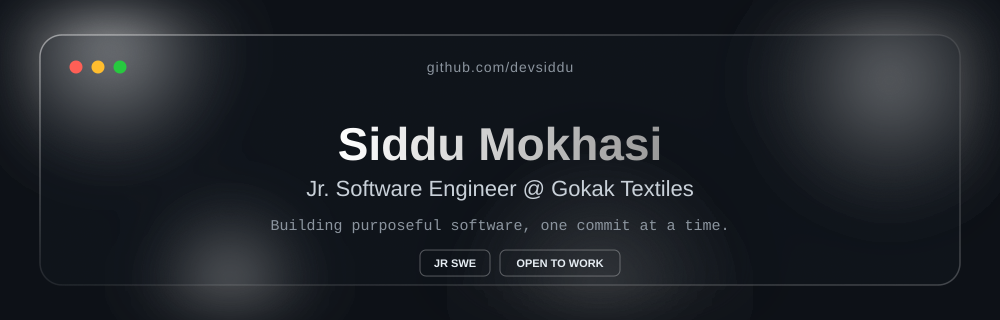

<div align="center">



<br/><br/>

[Portfolio](https://spirestack.vercel.app/) · [Email](mailto:your-email@example.com) · [LinkedIn](https://linkedin.com/in/your-linkedin)

</div>

---

### `> whoami`

```yaml
name: Siddu Mokhasi
role: Jr. Software Engineer
company: Gokak Textiles
location: Gokak
stack: [PHP, React, TypeScript, Python, MERN]
currently: sharpening full-stack skills & shipping real apps
```

---

### `> ./projects --list`

<table>
<tr>
<td width="50%" valign="top">

**🗂️ AMS — Admin Management System**
Company web app with role-based auth, a full admin panel (CRUD user management), and a role-based dashboard.

`PHP` `SQL Server` `WAMP`

</td>
<td width="50%" valign="top">

**📚 Kanaj — Library Management System**
Book management suite — add / update / return flows, ISBN-gated lookups, and automatic overdue fine calculation.

`React` `TypeScript` `Tailwind CSS`

</td>
</tr>
<tr>
<td width="50%" valign="top">

**🌾 Farmers Cafe**
Agricultural e-commerce platform connecting farmers with agri-input shops — shop switching, product management, approval flows.

`React` `TypeScript`

</td>
<td width="50%" valign="top">

**🎥 Face Recognition Attendance System**
Real-time attendance system, shipped in three variants — script, desktop GUI, and browser-based.

`Python` `OpenCV` `Tkinter` `face-api.js`

</td>
</tr>
<tr>
<td width="50%" valign="top">

**📝 Student Notes Platform**
Teachers upload notes in any format, students browse & download, with full role-based access control.

`MongoDB` `Express` `React` `Node.js`

</td>
<td width="50%" valign="top">

**➕ More on the way**
New builds land here regularly — pin your favorites above once they're public.

</td>
</tr>
</table>

---

### `> ./stack --verbose`

<div align="center">


</div>

---

### `> ./stats --live`

<div align="center">


</div>

<div align="center">

</div>

---

<div align="center">
<sub>Thanks for stopping by — let's build something.</sub>
</div>
